# SLAM Navigation for automated photovoltaic plant fault detection using drones

#### Author
    J. Rico (jvirico@gmail.com)

## **Abstract**

This work proposes theoretical bases for the implementation of automatic fault detection in photovoltaic plants using flying drones. It focuses on the drone’s localization and stabilization part, as a continuation of previous work done on Hot Spots identification using thermographic images captured from manually driven drones, and Convolutional Neural Networks.

## **Introduction**

The main focus is to address the problem of keeping a flying drone still even under external disturbances. The ambition is to use only the sensors available on the drone to estimate the current state, location in our case, of the drone, which is the most challenging part of the stabilization problem.

The most informative sensor is a camera, which is also a key source of data for visual localization used in the following system.

The report is organized as follows. First, we briefly describe the problem that motivates the research, the image recognition part using thermographic images and Deep Learning, then we will analyze some image processing techniques, after this, a flying drone Control System Model of a quadcopter is presented, and finally we will focus on the theoretical part of the system controlling the flight of a drone to stabilize it regardless of the inaccuracy of its sensors.

We will consider Simultaneous Localization and Mapping (SLAM) to track recognizable points in the camera image together with a 3D map of the points. The output location is afterwards combined using Kalman filter with odometry data to estimate future location based on the drone’s dynamics model. This is used afterwards for gain control of the drone’s flight when SLAM fails to estimate the pose of the drone.

To exemplify the stabilization problem, we will simulate a SLAM navigation on a simplified scenario, implementing FastSLAM, that relies on Particles Filter Method, using Python. We will see how SLAM behaves when the visual references are missing.

Main technologies considered on this work:

- Deep Learning for Hot Spot identification on thermal images, not in the scope of this document.
- Image Processing techniques to improve image based object detection on thermal images.
- Flying drone (quadcopter) certified for operation on industrial environments. We will introduce a possible Control System Model of a quadcopter.
- Camera based localization and navigation using SLAM.
- Drone stabilization using Extended Kalman Filter, interface and measurement model.
- SLAM navigation on simplified scenario (FastSLAM implementation using Python) based on Particle Filter (Sequential Monte Carlo). What happens when the visual support is missing?

## **Photovoltaic Plants and Hot Spots**

In big industrial facilities, fault identification of the different components of the plant is a critical part of the daily operation.

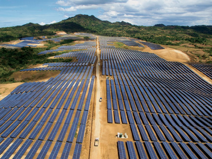

Figure 1. Aerial view of Photovoltaic Park.

This paper complements previous works done on automating the process of problem identification in photovoltaic cells for big photovoltaic parks, which is typically a slow, manual, and repetitive maintenance task.

Typically, the personal of the facility walks along the plant carrying a high resolution thermal camera (ex.: Testo 850i), to identify problems on the field.

Previous works explored the possibility of using drones provisioned with cameras and image processing techniques to improve this task. We will complement the image based event detection part suggesting several image processing and computer vision techniques.

### **Hot Spots**

Hot spots are areas of elevated temperature affecting only part of the solar panel. They are a result of a localized decrease in efficiency, which results in lower power output and an acceleration of the materials degradation in the affected area.

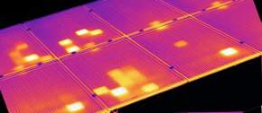

Figure 2. Hot Spots.

Solar panels generate significant power and hot spots can occur when some of that power is dissipated in a localized area. Hot spots are rarely stable and will usually intensify until failure of the panel performance in terms of electricity production and safety.

They are easily identifiable using thermographic images of the panels, like shown in the image above.

## **Drones, Thermographic images and Deep Learning - Previous works**

Previous works done on the Hot Spot identification using thermographic images captured from a flying drone, and Deep Learning algorithms showed successful results.

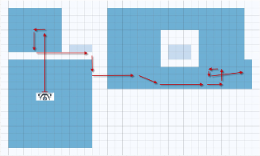

Figure 3. Plan of dron’s flight over testing area.

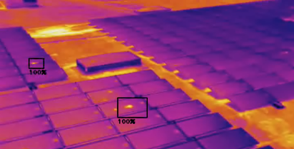

Figures 4. a) Hot Spots identification using Convolutional Neural Networks.

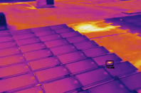

Figure 4. b)

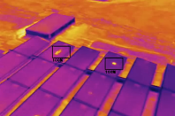

Figure 4. c)

This opened another challenges, like (1) assignment of Hot Spots to its exact panels or areas of the plant (see image below), and (2) automation of the drone’s flight, and its localization, navigation and stabilization. As an alternative, manually operated drone by personal of the facility was considered. The main focus of this document is to cover the later part (2) applying SLAM and Kalman Filter.

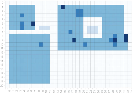

Figure 5. Hot Spot identification on the map (1).

Following, an analysis of classic image processing and computer vision techniques to improve image-based object recognition, an introduction to a basic quadcopter Control System Model, and a proposal on how to approach the localization and stabilization of flying drones (quadcopter) using SLAM and Extended Kalman Filter. Based on papers [1] and [2], and on the materials of the subjects ‘Basic Image Processing’ and ‘Multimodal Sensor Fusion’ of the IPCV Erasmus Mundus Degree, at PPCU, Budapest, Hungary.

## Classical Image Processing **techniques analysis**

Following, we consider two classical image processing techniques for Line Detection, an analysis that could be used to improve object detection in the context of this project:

- Canny Edge detector
- Hough Transformation

### **Canny Edge detector**

A three step operation is performed on the image to extract an edge network. (1) Gradient map calculation, (2) Edge thinning by non-maxima suppression, and (3) Hysteresis threshold.

For each pixel of the image:

1. This step obtains the gradient magnitude of the pixel, that indicates how sharp the edge is, and its direction (edge normal).
2. Thinning edges by setting pixels to zero if its magnitude is not greater than the magnitude of its neighbors in the gradient direction. This is called non-maxima suppression.
3. We decide if the pixel is part of an edge or not by using hysteresis thresholding. Two thresholds (t1, t2). If pixel *value > t2* it is an edge. If *t2 < value < t1* then it is an edge if it has a neighbor classified as edge in the direction perpendicular to its edge normal calculated in (1).

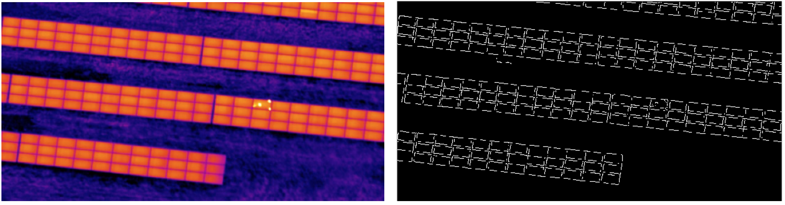

Figure 6. Canny Edge Detector on cenital view of plant.

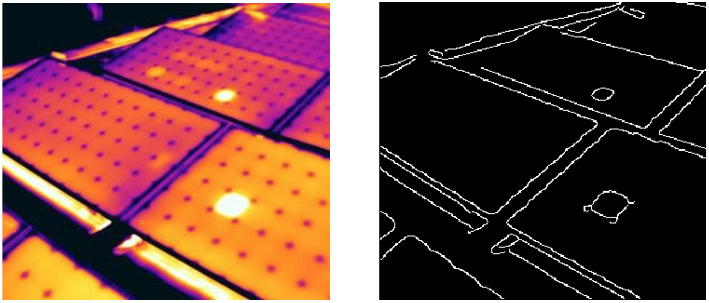

Figure 7. Canny Edge Detector of closed view of panels.

### **Hough Transformation (line detection)**

This technique uses Polar equation to represent an image in Hough space, where all points that form one line in the Euclidean space are represented by sinusoids that cross each other in a single point in Hough space.

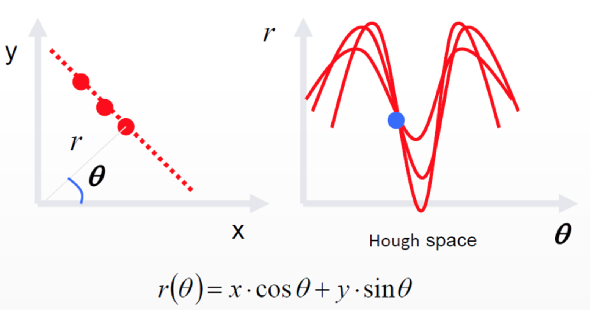

Figure 8. Hough space.

The selection of the *n* maximum values (7 in the example below) in Hoght space will give us *n* lines on the original image.

Figure 9. N-maxima selection in Hough space.

The n maximums can be represented back in Euclidian Space by using the Polar equation.

$$r(\theta) = x*cos\theta + y*sin \theta$$

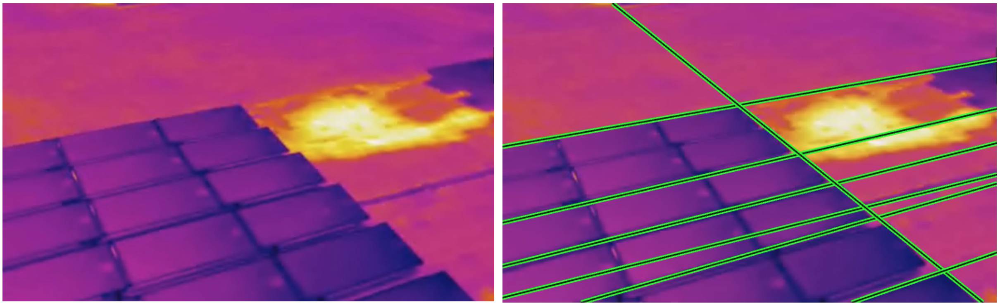

Figure 10. Line detection applying Hough Transform.

## **Drone Control System Model**

There are typically two configurations for a quadcopter, ‘+’ configuration and ‘x’ configuration.

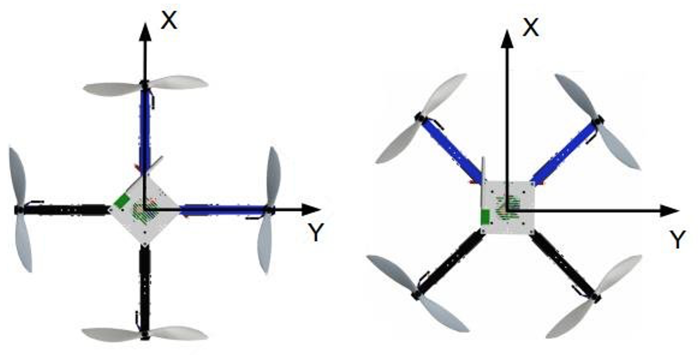

Figure 11. + configuration (a), x configuration (b).

We will consider ‘x’ configuration for the model.

The position of the drone is defined in the axes x, y, z by x. The angular position is defined with three Euler angles by h. And the vector q contains the linear and angular position vectors.

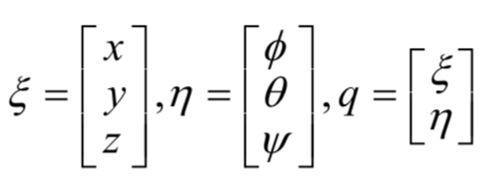

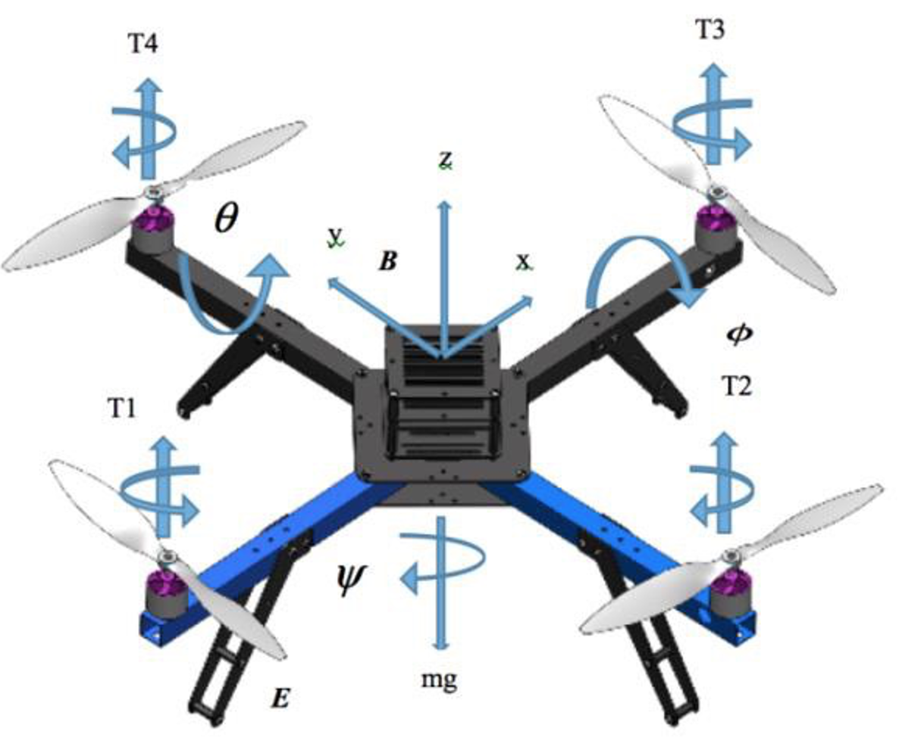

Figure 12. Forces, moments and reference systems of a quadcopter.

The angular position of the quadcopter is composed of three angles, corresponding to the rotation of the quadcopter around each of the axes x(φ), y (θ), z (ψ). Roll, Pitch, and Yaw respectively.

The Control System of the quadcopter is capable of controlling the navigation. Increasing/decreasing the rotation speed of all propellers (T1, T2, T3, T4) it can make movements flying up and down, by changing the equilibrium of propeller speed, direction and moments, it controls the yaw, roll and pitch.

The vector ‘u’ represents the desired roll, pitch, yaw and yaw rate respectively, for the Control System to update its position to change to next state.

u = (φ , θ , ψ , v )

We will see how this control vector, together with the relation of two subsequent states (with 3D speed vector, roll, pitch, yaw, and yaw rate) can be used in the measurement model of an Extended Kalman Filter to correct the filter’s prediction of the process state, to predict the near future state of the quadcopter when the SLAM system fails to estimate a pose of the drone from video frames.

## **Localization and stabilization**

Different methods can be utilized to support the stabilization of Unmanned Aerial Vehicles (UAV). Down-looking cameras can be used to stabilize a UAV, but the method is sensible to insufficiently textured grounds surfaces lacking distinguishable landmarks. Another approach is to utilize external beacons. These two methods require external support, but are very precise. This limits its usage to prepared environments. For outdoors flight, GPS-based localization can be used.

Following we introduce how SLAM, Simultaneous Localization and Mapping, can solve this. The problem we are facing consists on constructing and updating a map of an environment while simultaneously keeping track of an agent’s location within it.

### **Problem definition**

Given a series of controls $*u_t*$ and sensor observations $*o_t*$ over discrete time steps *t*, the SLAM problem is to compute an estimate of the drone’s location $*x_t*$ and a map of the environment $*m_t*$. All quantities are usually probabilistic, so the objective is to compute:

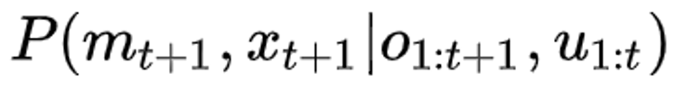

Applying Bayes' rule gives a framework for sequentially updating the location posteriors, given a map and a transition function

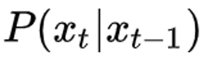
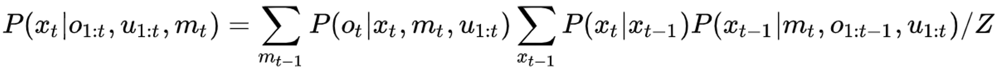

Similarly the map can be updated sequentially by:

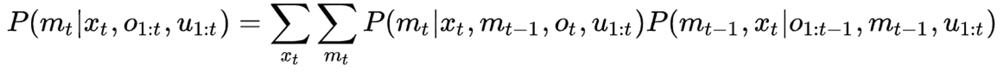

Like many inference problems, the solutions to inferring the two variables together can be found, to a local optimum solution, by alternating updates of the two beliefs in a form of EM algorithm.

## **Visual Localization and Mapping - SLAM**

In order to localize the drone, the system maintains a map of landmarks observed in the environment using images from a mounted camera on the drone. Usually the map is not updated for every frame, only for certain keyframes. Keyframe composes of a video frame, a set of keypoints , and a pose estimation, which can be later updated in order to increase the precision of the pose and therefore even the precision of the associated keypoints locations.

The map has to be initialized before the localization. This is done by inserting first two keyframes which define the origin of the coordinate system and its scale to the real world. The points in those keyframes are then used as the first landmarks in the map.

Having the map, we can compare it with landmarks observed in every frame to localize the drone.

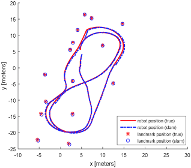

Figure 13. Map displaying Landmarks, slam navigation and ground truth.

Later, we will give a python implementation of FastSLAM (based on the **Particle Filter** method) on a simplified scenario (2D map), considering x, y special coordinates, linear, and angular velocities.

### **Localization**

Assuming a calibrated pinhole camera projection model *CamProj*:

Where *x*, *y*, *z* are the coordinates of a landmark relative to the current camera pose and $*u_i*$, $*v_i*$ are the (pixel) coordinates of the landmark projection into the image plane of the camera.

Let CameraPoseTrans($\mu$,$p_i$) denote the location of the landmark $*p_i*$ relatively to the camera pose $*p_i*$, We can use the defined projection to express the reprojection error vector $*e_j*$ of the landmark with coordinate vetor $*p_j*$ (relative to the map origin) which was observed at $*u_j*$, $*v_j*$. Reprojection error is the difference between where the landmark $*p_j*$ should be observed according to the map, if the drone’s pose in $\mu$, and where it was observed using the camera.

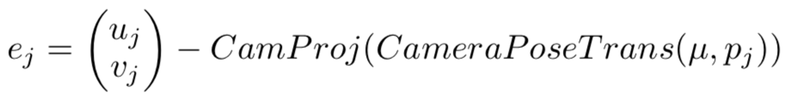

In the correct pose of the drone, the reprojection errors should be very small. Therefore we can use $*e_j*$ for finding the most-likely camera pose $\mu’$:

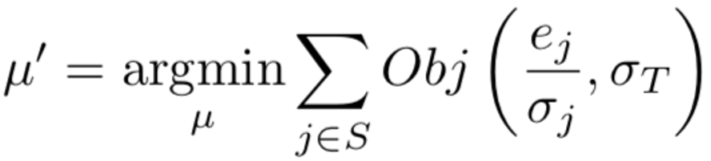

Where *S* denotes the set of landmark observations, $Obj(.,\sigma_T)$ is the Tukey biweight objective function, and $\sigma_T$ is a robust estimate of the distribution’s standard deviation.

### **Mapping**

Mapping is a process of adding newly observed landmarks into the map and updating the pose of known landmarks after further observations in order to improve the precision of their location. It is important to have into consideration that computationally expensive calculations like all mapping operations, should be done in separate threads.

In this way, when the mapping thread is not working on adding new keyframes, the system uses the spare time to improve the accuracy of the map.

The position of a landmark is initially computed from its first two observations, after this initialization we can improve that by minimizing the reprojection error of the landmark’s location for all observations and landmarks.

Assume that we have N keyframes {1, … ,N}. In each of them, we observed a landmark set $*S_i*$, which is a subset of a set {1, …, M} of all *M* landmarks. We will denote the *j*th landmark observed in some keyframe *i* with the subscript *ji*. $\mu_i$ is the pose of a keyframe *i* and $*p_j*$ is the location of a landmark *j*. Bundle adjustment is then used to update the poses of keyframes and the locations of landmarks:

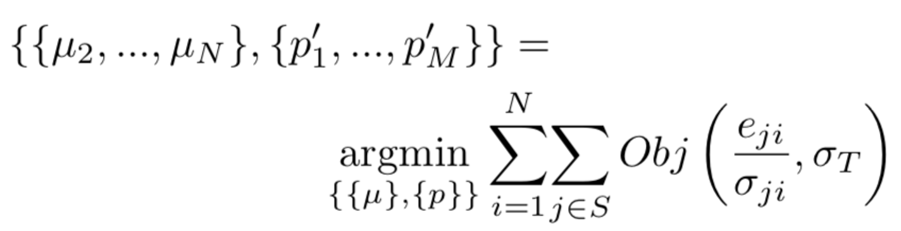

Note that the pose of the first keyframe is fixed in the origin of the map, hence  $\mu_2$.

## **Stabilization – EKF, blind navigation using state-from-measurements estimations**

When the visual tracking used in SLAM is considered lost, some method is needed to replace the visual pose estimate and to predict the relative pose changes based on previous observations.

We will use **Extended Kalman Filter** to represent the posterior distribution of this stochastic process using the previous observed measurements from the drone’s sensors.

In this way, the system should be able to process video frames together with a pose prediction based on previous state estimation, alternating between SLAM navigation and navigation based on a predicted model (without visual support).

First, we will define the interface (with drone’s control system) and measurement model of the **Extended Kalman Filter**, based on the drone’s model described previously. We will not describe the motion model.

### **Extended Kalman Filter (EKF)**

The goals are noise filtering, processing multiple measurements of a single variable, and prediction of the state of the system in the near future.

Note:

---

The extended version of Kalman Filter is necessary due to the nonlinear nature of the drone’s flight dynamics, so instead of partial derivatives, the Jacobian of State Transition *F* and the Observation Matrix *H* of Kalman is computed. *F* and *H* are defined to be the following Jacobians:

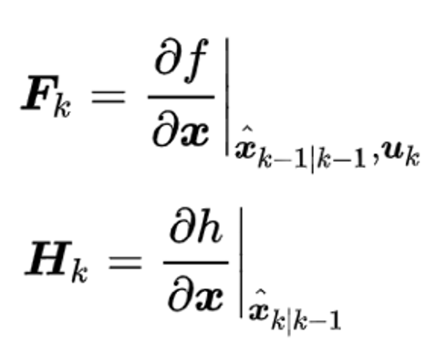

---

EKF stores the state as a (multivariable) normal distribution of X represented by its mean and covariance matrix.

Similarly, measurements are perceived as a normal distribution of Z with the mean value equal to the received measurement. Its covariance matrix is usually fixed and represents the precision of sensors. Finally, EKF receives a control vector, which describes the command sent to the drone. 

The relation between two subsequent states and the control vector *u* is defined by a process model $P(X_k|X_{k-1},U_{k-1})$, the relation between state and measurement is defined by a measurement model $P(Z_k|X_k)$. We will further denote the means of the state and the measurement at a time *k* as $X_k$ and $Z_k$.

Note that the measurement model determines measurements from states to compare it with received measurements and not vice versa.

The major tasks of an EKF utilization is to implement the process and measurement models.

1. Interface between EKF and drone’s control system
    - $x_k = (x,y,z,v_x,v_y,v_z,\phi,\theta,\psi,d\psi)$ - 3D coordinates relative to map origin, 3D speed vector in the same system, roll, pitch, yaw and yaw rate.
    - $u_k=(\overline{\phi},\overline{\theta},\overline{\psi},\overline{v_z})$ - desired roll, pitch, yaw and yaw rate as sent to the drone.
    - $z_k=(v_x^`,v_y^`,v_z^`,\phi,\theta,\psi,x,y,z)$ - measured speed in 3D coordinates relative to the drone, roll, pith, yaw and the drone’s coordinates in 3D from the visual localization system.

2. Measurement model

The measurement model is used to correct the filter’s prediction of the process state *xk* according to the obtained measurement. The main part of the model is a function $z_k=g(x_k)$, which is used to compute the expected measurement to be compared with the measurement obtained from the drone.

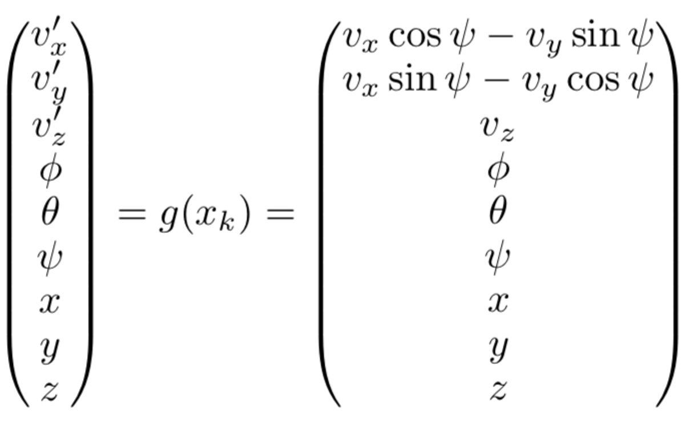

Together with the function *g*, the measurement model contains a covariance matrix, which specifies the precision of sensors. When the visual location system fails for a moment, the variances of it’s output, location (*x*, *y*, *z*), are increased, so that the filter practically ignores the measurements (*x*, *y*, *z*) and updates the pose of the drone according to the process model and the other measurements.

## **SLAM navigation on simplified scenario – FastSLAM implementation**

### **FastSLAM**

FastSLAM algorithm implementation is based on Particle Filter or Sequential Monte Carlo. It represents the drone’s estimation through a series of particles. Each particle has an independent belief, as it holds the pose (*x*, *y* and $\theta$) and an array of landmarks locations [(*x1, y1*), (*x2, y2*),….( *xn, yn*)] for *n* landmarks.

Each particle maintains a deterministic pose and n-EKFs for each landmark and updates it with each measurement.

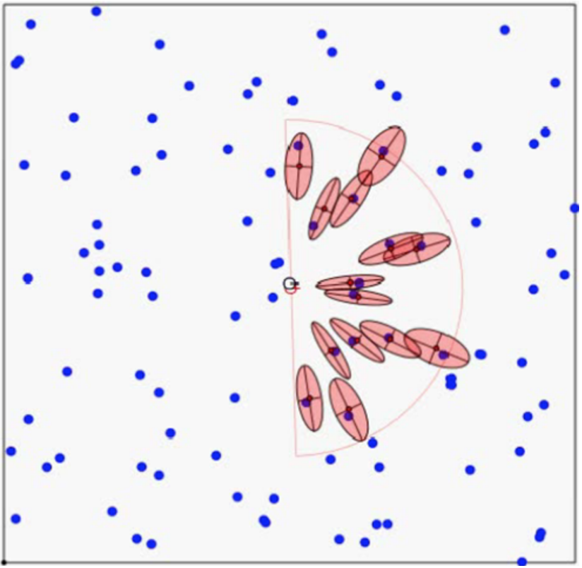

Figure 14. Drone's estimation using Particle Filter.

### **General Steps**

The particles are initially drawn from a uniform distribution that represent the initial uncertainty. At each time step the algorithm does:

- Predicts the pose for each particle by using *u* and the motion model (the landmarks are not updated).
- Updates the particles with observations z, where the weights are adjusted based on how likely the particle has the correct pose given the sensor measurement.
- Resamples such that the particles with the largest weights survive and the unlikely ones with the lowest weights die out.

### **Pseudocode**

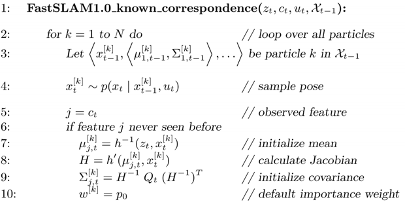
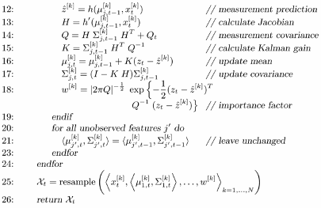

### **Python implementation**

We give a python implementation of FastSLAM (based on **Particle Filter** method) on a simplified scenario (2D map), considering x, y special coordinates, linear, and angular velocities (*v*, *w*).

The equations of this model are:

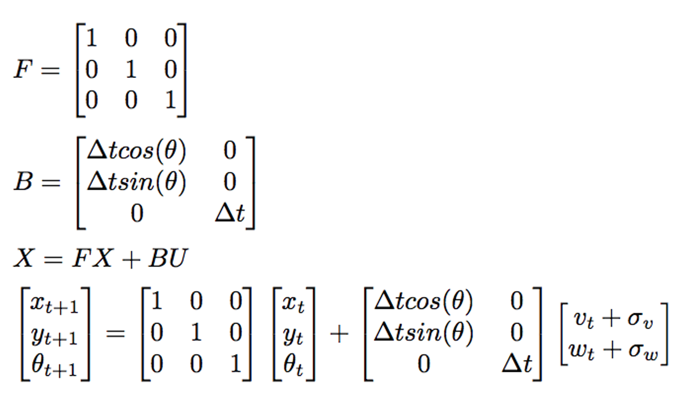

Visualizations:

- The black line is the drone’s trajectory.
- The red dots represent the distribution of particles.
- The blue x represent the observed landmarks.

### **Normal SLAM navigation**

The system is initialized with the following values.

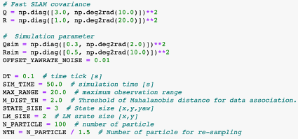
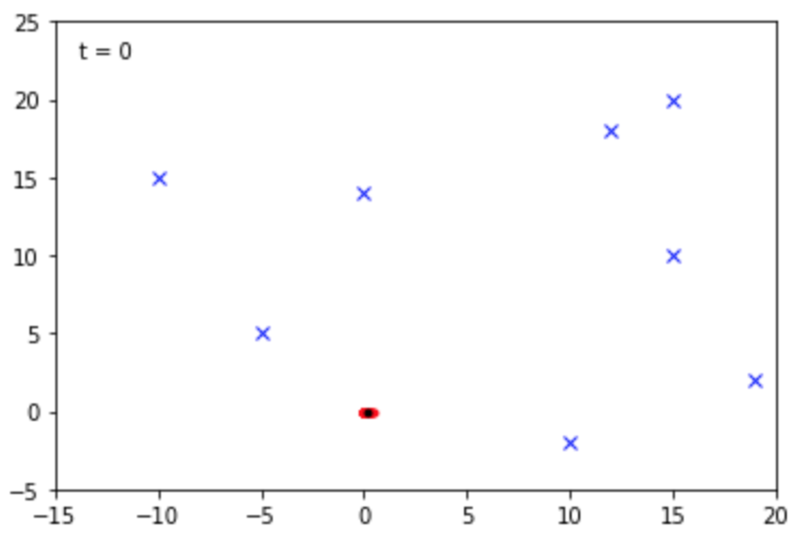

Figure 15. Model initialization with 8 landmarks.

Eight landmarks are provided simulating the landmarks recognized from the video frames. The black dot surrounded by red dots is where the navigations begins.

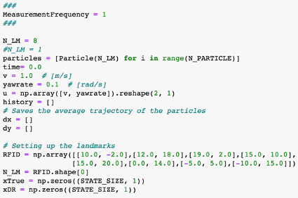

New observations are received continuously so the particles are updated and resampled on each iteration.

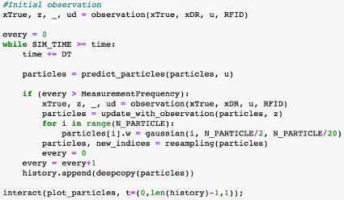
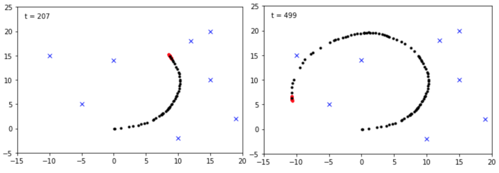

Figure 16. We can see the drone’s trajectory in timestamps t = 207 and t = 499.

As we observe in Figure 16, the drone navigates according to the motion model described above.

### SLAM Navigation with less frequent landmarks observations

In this scenario we will simulate how the navigations is affected when the observed landmarks are less frequent while the drone keeps in motion.

We will provide new observations and resampling every 100 steps.

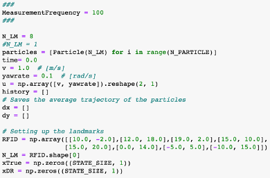
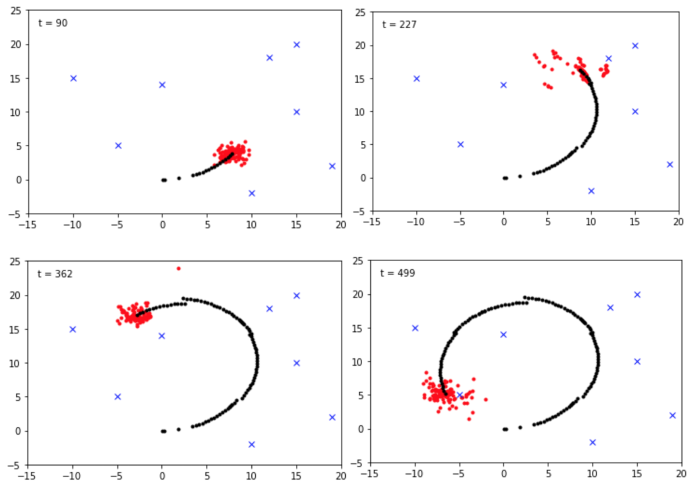

Figure 17. Drone’s trajectory at 4 different timestamps.

We can observe (Figure 17) how the lack of information from the visual system affects the drone’s trajectory and degrades the particle model.

### SLAM Navigation with very few landmark observations

Now we set up the environment providing only one landmark, this is representing a scenario where the drone cannot rely on visual references anymore.

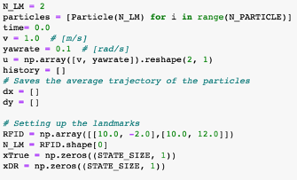
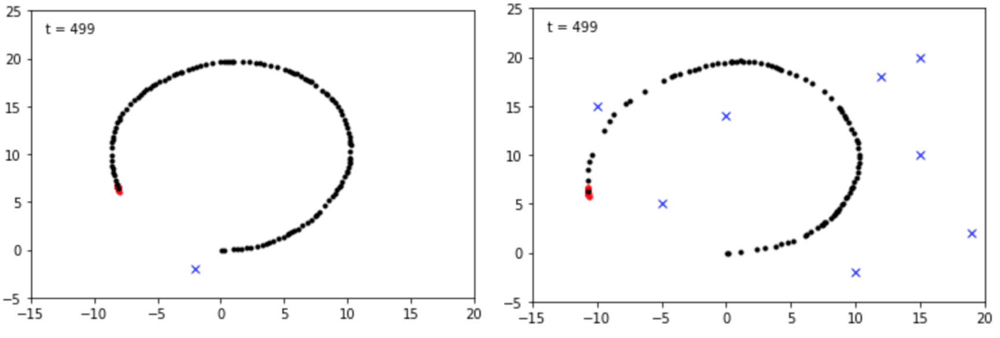

Figure 18. Drone’s trajectory using 1 and 8 landmarks.

If we compare the navigation with 1 and 8 landmarks, Figure 18, we can see differences in the drone’s trajectory due to the lack of visual references, especially towards the end.

## **Conclusion**

As has been presented before, the idea of using EKF as a support method for stabilizing the drone’s navigation would work as follows, when the visual location system fails for a moment, the variances of its output, location (*x*, *y*, *z*), are increased so that the system practically ignores the measurements (*x*, *y*, *z*) from SLAM and updates the pose of the drone according to the EKF process model and the other measurements.

In this way, the system should be able to process video frames together with a pose prediction based on previous state estimation, alternating between SLAM navigation and navigation based on a predicted model (without visual support) to ensure a more stable navigation.

**Open topics for further investigation**

1. Application of image processing techniques to improve image detection of Hot Spots and other failures not considered in previous works, as well as other applications based on image processing and computer vision like fire detection, personal invading hazard areas, identification of personal without mandatory safety equipment (ex. vest and helmet).
2. Integration of insights collected from images into Building Information Modeling (BIM) system and Data Analytics System of the facility that usually collects data from the Control System of the plant (SCADA) to facilitate data analytics and predictive analysis of relevant events.
3. Logistics of drone operation, autonomy, drone fleet, flight plan optimization to cover large areas, emergency protocols in case of drone failure.
4. Computational capacity of industrial drones, real-time/non-real-time image evaluation, the technological infrastructure required to scale to production.

## Cite this work
    J. Rico, (2019) SLAM Navigation for automated photovoltaic plant fault detection using drones. 
    [Source code](https://github.com/jvirico/SLAM_Navigation)

## **References**

[1] - SKODA, Jan; BARTÁK, Roman. Camera-based localization and stabilization of a flying drone. En The Twenty-Eighth International Flairs Conference. 2015.\
[2] - THU, Kyaw Myat; GAVRILOV, A. I. Designing and modeling of quadcopter control system using L1 adaptive control. Procedia Computer Science, 2017, vol. 103, p. 528-535.\
[3] - [Simultaneous localization and mapping Wikipedia](https://en.wikipedia.org/wiki/Simultaneous_localization_and_mapping).\
[4] - [PythonRobotics Documentation](https://readthedocs.org/projects/pythonrobotics/downloads/pdf/latest/).
[Fast Slam](https://pythonrobotics.readthedocs.io/en/latest/modules/slam.html#fastslam1-0).\
[5] - [FastSLAM – Feature-based SLAM with Particle Filters](http://ais.informatik.uni-freiburg.de/teaching/ws12/mapping/pdf/slam10-fastslam.pdf).
